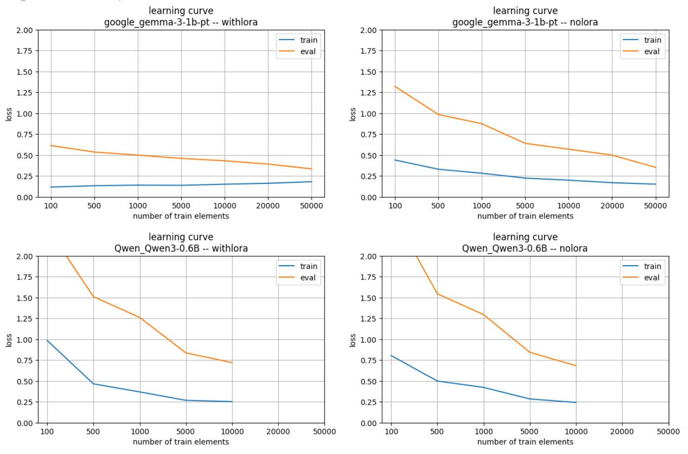
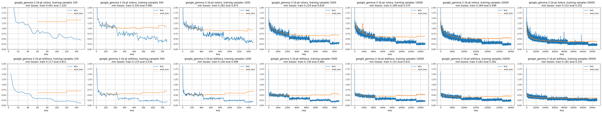

# llm-finetune-ablations

Trains models with increasing data and builds learning curves. See `finetune.sh` and `finetune.py` to see how to launch it.

Training logs are kept under the `results` folder. You will find there runs for `Gemma-3-1B-pt` and `Qwen-3-0.6B`.

These are the learning curves for those two models, getting the best train and eval loss for each training run. See `visualize.ipynb` for plotting

Also, you can plot the actual loss history during each training. For instance for `Gemma-3-1B-pt`.

